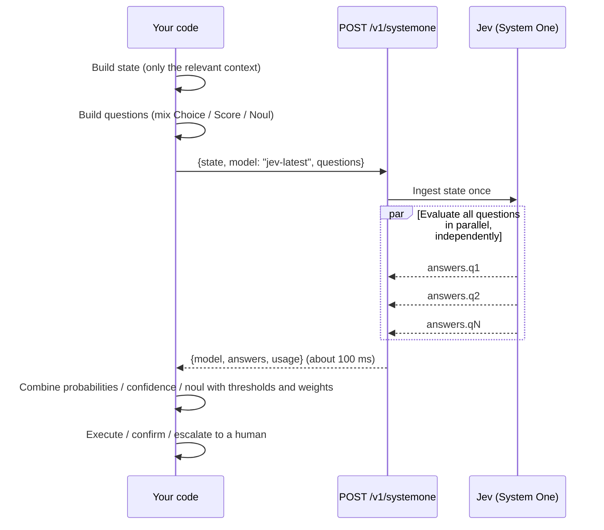
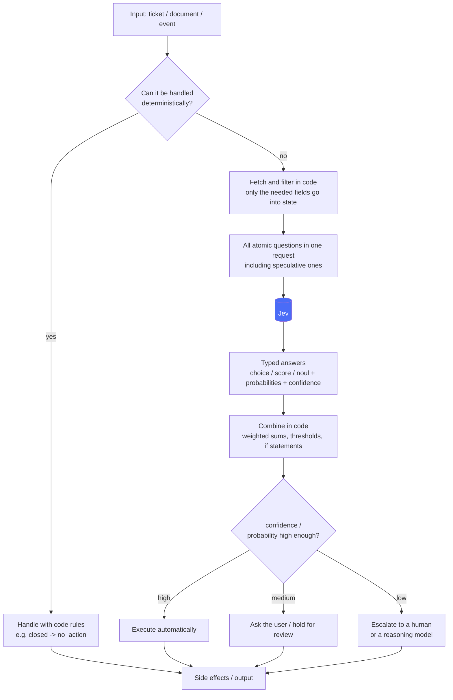
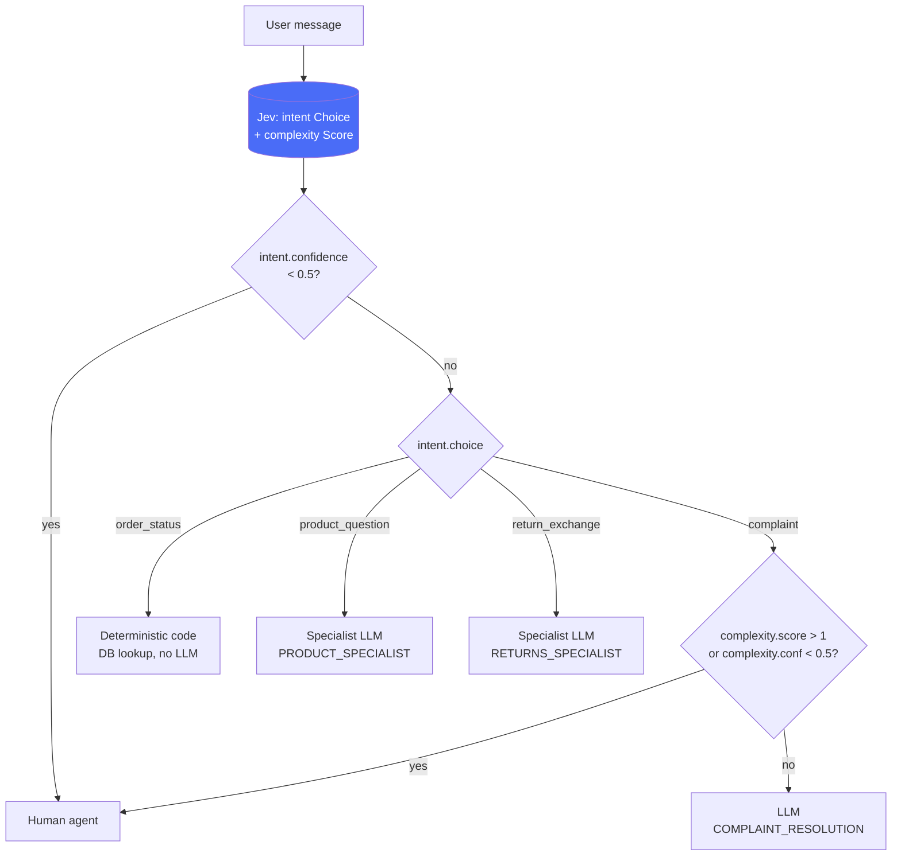
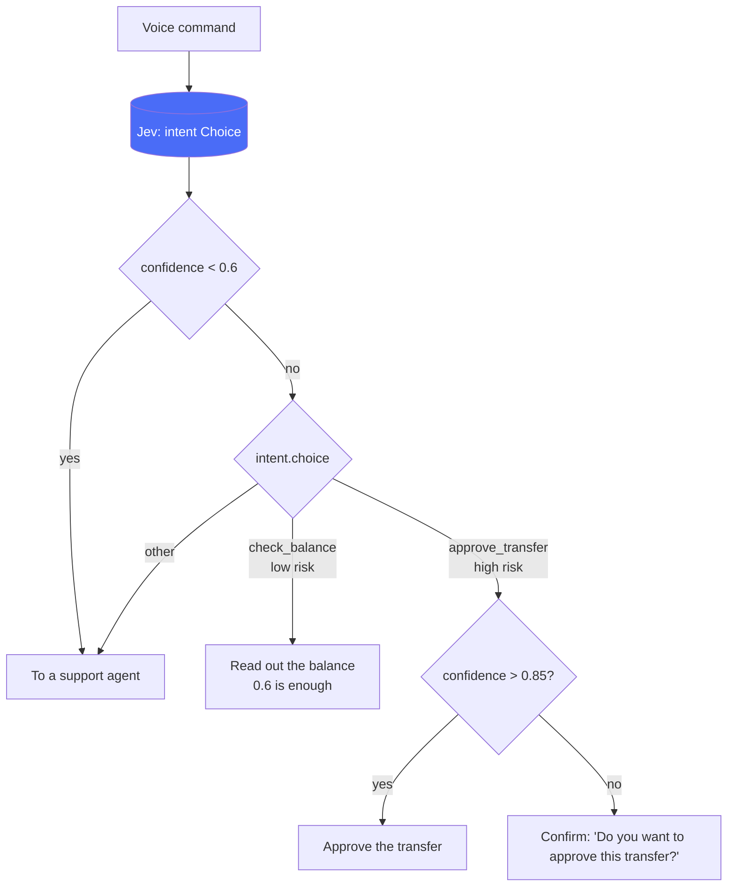
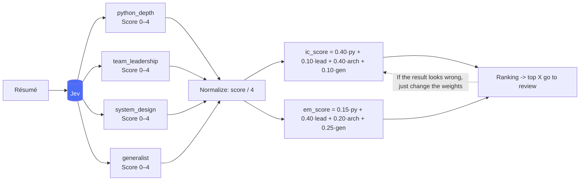
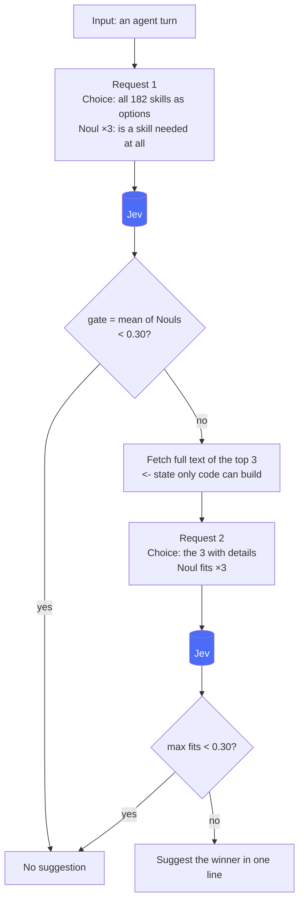
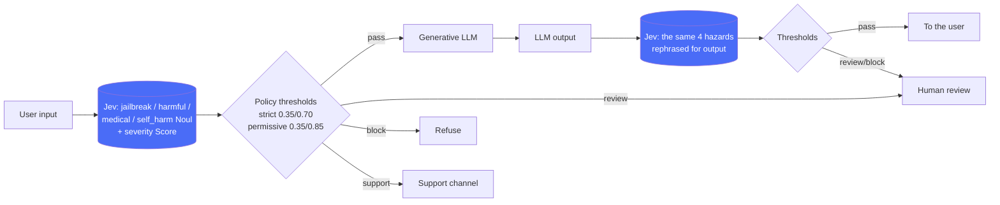

# 2. Typical workflows (diagrams)

Mermaid diagrams of the typical workflows that emerge from the documentation as a whole. They render in the GitHub / VS Code preview.

## 2.1 Basic cycle: one request end to end

## 2.2 AI-powered software: code stays in control, the model only judges

## 2.3 Support ticket triage (speculative fan-out + confidence-gated routing)

A flow that merges the 5-Choice example from the official primitives page with `triage_ticket.py` from the official how-to-build page.

```mermaid
flowchart LR
    T[Ticket] --> S["state = {ticket, customer, policy}"]
    S --> R[One request]
    R --> Jev[(Jev)]

    subgraph Q[Questions sent together]
        direction TB
        q1[department: Choice]
        q2[return_reason: Choice, speculative]
        q3[shipping_issue: Choice, speculative]
        q4[requested_resolution: Choice]
        q5[tone: Choice]
        q6[requests_credentials: Noul]
        q7[sender_identity_mismatch: Noul]
        q8[unexpected_reward: Noul]
        q9[frustration: Score]
    end
    Jev --> Q

    Q --> Spam["spam_risk = 0.45·q6 + 0.30·q7 + 0.25·q8"]
    Spam --> SG{0.4 < risk < 0.6<br/>or department.conf < 0.3?}
    SG -- yes --> H[Human triage]
    SG -- "risk ≥ 0.6" --> Qu[Quarantine]
    SG -- no --> D{department.choice}
    D -- returns --> Ret[To the returns team<br/>issue = return_reason.choice]
    D -- shipping --> Shp[To the shipping team<br/>issue = shipping_issue.choice]
    D -- billing --> Bil[To the billing team<br/>ignore return_reason / shipping_issue]
    Ret & Shp & Bil --> Copy[Also copy to the second team<br/>where probabilities > 0.25]
    Copy --> Res{requested_resolution<br/>.confidence < 0.5?}
    Res -- yes --> Ask[Ask the customer what they want]
    Res -- no --> Flag[Flag for approval if refund]
    Q --> Tone{tone == angry or<br/>frustration ≥ 1.5 & conf ≥ 0.7}
    Tone -- yes --> Senior[Senior agent / high priority]

    style Jev fill:#4a6cf7,color:#fff
```

## 2.4 Intent routing: spend expensive resources only on requests that need them

## 2.5 Confidence-gated routing: vary the threshold with the risk of the action

## 2.6 Composite scoring: measure the parts, combine in code

## 2.7 Coarse-to-fine in two stages (skill suggestion / re-ranking / hierarchical classification)

Send a second request only when the dependency is real: when the state / options for the second request cannot be built without the first answer.

Flows of the same shape: BM25 shortlist -> rerank with a Noul on every pair / a Choice at each level of the taxonomy -> keep the top K paths with beam search / extract with a mini model -> verify with a Noul battery -> promote only the suspicious fields to a reasoning model (SDE cascade).

## 2.8 LLM guardrail / verification: inspect another AI's input and output

Same shape: citation check (string match in code, context judgment as a Choice, auto-accept at conf ≥ 0.8) / tool-call trace verification (arguments vs schema, ID correspondence, coordinate carry-over as 9 Nouls) / RAG passage selection (4 Nouls, relevant / evidence / contradicts / injection, thresholded in a fixed order).

## 2.9 What goes where (quick reference for the division of responsibilities)

```mermaid
flowchart LR
    subgraph Code[Code side]
        c1[Control flow, loops]
        c2[Deterministic rules, side effects]
        c3[Fetching, filtering and structuring state]
        c4[Arithmetic, counting, date math, regex]
        c5[Weights, thresholds, routing constants<br/>kept in one file]
        c6[Combining answers and the final decision]
    end
    subgraph Jev[Jev side]
        j1[Classify: which one]
        j2[Detect: is it present]
        j3[Rate: how much]
        j4[Verify: is it supported]
        j5[Pick from candidates: a substitute for extraction]
    end
    subgraph LLM[Generative LLM side]
        l1[Free-text replies]
        l2[Splitting compound requests]
        l3[Generating candidates]
        l4[Escalation target for hard problems that need reasoning]
    end
    Code --> Jev --> Code
    Code -. only when needed .-> LLM
```

## 2.9 Use cases combined with an existing LLM

TypeSafe is not a replacement for an LLM. It is a judgment component placed before, after and
around one: **the LLM generates, TypeSafe judges and gates, code controls and holds the
thresholds**. What it guarantees is calibration, not correctness: an event it calls 0.8 happens
about 80% of the time, and confidence 1.0 only means the distribution collapsed onto one point.
Its value is being able to say "I don't know", which is what makes high confidence → automate,
low confidence → human work.

| Position | Use case | Question design | Source |
|---|---|---|---|
| Before the LLM | Model routing | `intent` Choice + `complexity` Score; intent.confidence < 0.5 → human | Intent routing pattern |
| Before the LLM | Input guardrail | hazard Nouls + severity Score; hazard → action map, fixed precedence (2.7) | Guardrails cookbook |
| Before the LLM | Skill / tool selection | Choice over every skill + Nouls "is one needed at all"; re-judge the top 3 | Skill suggestion cookbook |
| Before the LLM | Function-call arguments | function Choice + one Choice per closed-set argument + `stated` Noul; call confidence = min of parts | Function calling cookbook |
| After the LLM | Citation check | code finds the quote → Choice supports / contradicts / says_nothing; confidence ≥ 0.8 auto | Citation check cookbook |
| After the LLM | Tool-call trace verification | 9 Nouls (tool sound, args match schema, ids, units, dates) instead of "is the trace correct" | How to build page |
| After the LLM | Output guardrail | the input hazards reworded for a reply (`jailbreak` → `broke_policy`) | Guardrails cookbook |
| After the LLM | Extraction verification cascade | mini model extracts → per-field Noul battery → `max` > 0.7 escalates to a reasoning model | SDE cascade cookbook |
| Inside RAG | Re-ranking | BM25 shortlist × one Noul per query-passage pair | Re-ranking cookbook |
| Inside RAG | Passage selection | 4 Nouls per pair (relevant / evidence / contradicts / injection), fixed-order gates, injection first | Classifying RAG passages cookbook |
| Inside RAG | Line-level find | Choice over line ids + Noul "does an answer exist" | Semantic find cookbook |
| Division of labor | Candidate generation + selection | regex / NER / LLM propose spans, Choice picks "which / none" | Pre-parsed value extraction cookbook |
| Division of labor | Compound requests | Noul "several actions?" → LLM splits → re-judge each part | Smart home demo |
| Operations | Eval judge / monitoring | same input × 15 → probability std ≈ 0.01; 20–900× cheaper than an LLM judge | Self-consistency cookbooks |
| Operations | Semantic lint, trace classification | team conventions as questions in CI; classify every trace | Use case map |

Design checklist: (1) a judgment TypeSafe can make *before* the LLM call (routing, guards);
(2) verification of the LLM's output *afterwards* (citations, tool calls, extracted values);
(3) RAG candidates filtered before they reach the LLM; (4) the LLM left only where generation is
needed, judgment in TypeSafe, control / thresholds / arithmetic in code; (5) questions and
thresholds in one file, tuned by plotting confidence against accuracy.
