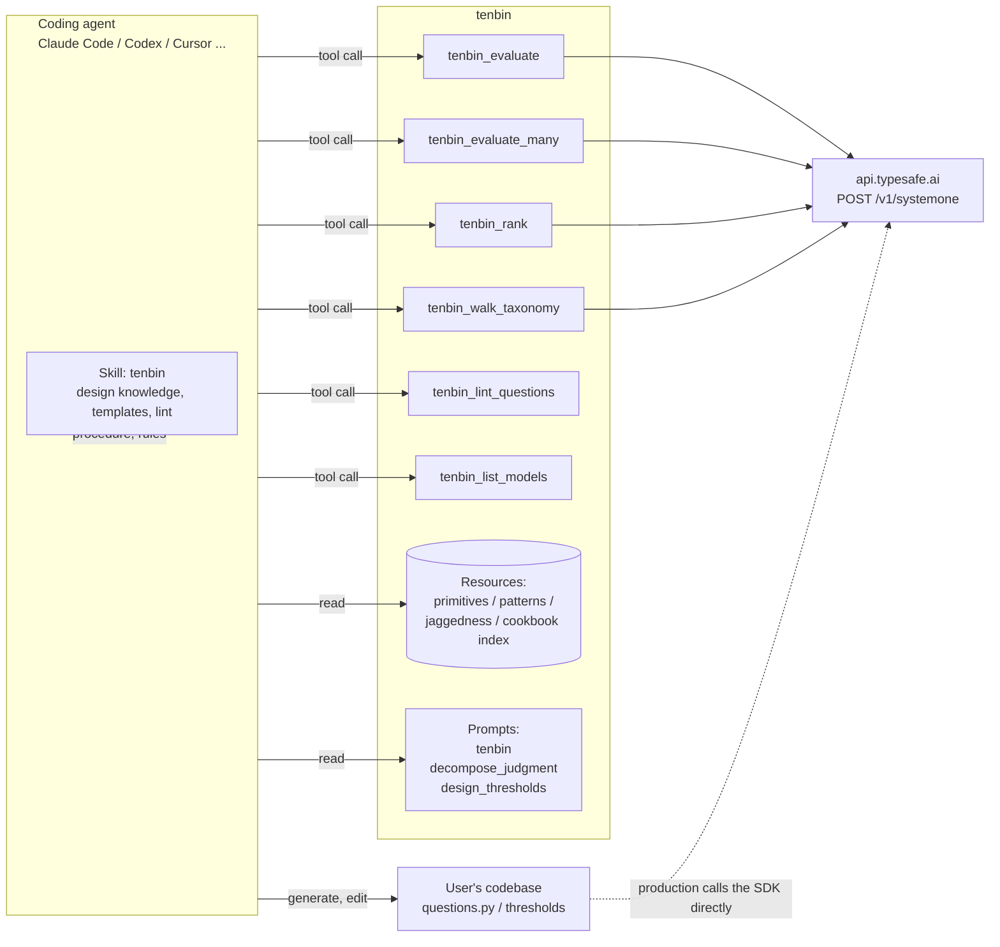
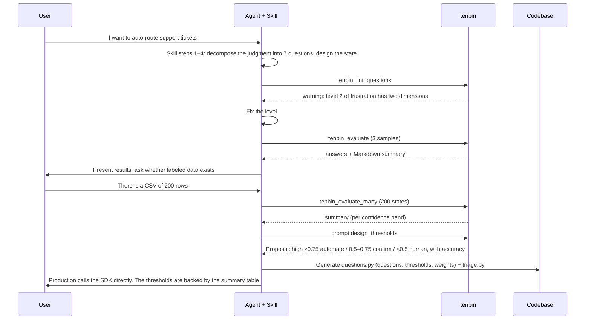

# 3. Design: Tenbin (general-purpose TypeSafe MCP server) & Agent Skill

> **Implementation status (2026-09-21)**: the MCP server is implemented in [`tenbin/`](../tenbin/) (Phases 1–3: 7 tools, 6 guide resources + examples, 4 prompts, stdio). The Skill (Phase 4) is implemented in [`skills/tenbin/`](../skills/tenbin/) (SKILL.md, 10 reference files, 5 templates, 4 scripts plus their tests). Differences from the design: the 6 guides in `reference/` are copied from the MCP's `resources/` by `sync_resources.sh`, `reference/state.md` and `scripts/evaluate.py` (stdlib HTTP client so the skill runs without the MCP) were added, the `rerank.py` template was not created (the `tenbin_rank` tool and the cookbook stand in for it), and the official-skill sync script was not created (the official skill is covered by referring to `llms.txt` instead). Streamable HTTP / evals (Phase 5) have not been started. Differences from the design on the MCP side: tools return JSON only (no `response_format`, Markdown or CSV rendering), `rank` uses a `{candidate}` placeholder scheme and, with multiple batches, normalizes to conditional probabilities in a final round, `lint` gained `unknown_type` / `no_questions`, and the body-logging flag was dropped. The session budget counts in-flight calls as reservations, and an MCP cancellation stops further requests from being issued.

The `tenbin` discovery command is available through the skill and as an argument-free
MCP prompt. It uses the current project and conversation to propose evidence-backed
applications, integration points, and minimal trials. `resources/suggestions.md` is
the shared workflow, embedded in the prompt and synced into the skill. Suggestions
are generated by the host agent without TypeSafe API calls or file changes. The MCP
server does not inspect the host's repository. Offline mode exposes this prompt, the
linter, and all guide/example resources; the other three prompts and API tools still
require a configured gateway.

Goal: let a coding agent use TypeSafe correctly at both **design time** and **run time**, from any project.

- **Skill (design time)**: how to decompose a judgment into atomic questions, which pattern to use, where to put thresholds, what not to ask the model. Text knowledge + templates + a lint script.
- **MCP server (run time)**: call the API safely. Single evaluation, batch evaluation, re-ranking, taxonomy walk, question lint, cost management. Lets the agent run the loop of "try it, look at the numbers, then decide the thresholds".

The official `typesafe-ai/skills` (https://docs.typesafe.ai/agent-skill) is SKILL.md only and has no way to call the API. This design is a superset: it absorbs the official skill's knowledge and adds a means of execution through MCP.

---

## 3.1 Overview



Principle for the division of roles: **MCP is a tool for experimentation, verification and operational support; production code calls the SDK directly**. The goal is for the questions and thresholds the agent tried through MCP to land as-is in a constants file in the user's code.

---

## 3.2 MCP server `tenbin`

### 3.2.1 Basic policy

| Item | Decision | Reason |
|---|---|---|
| Language | TypeScript + `@modelcontextprotocol/sdk` + `@typesafe-ai/sdk` | Type inference (`ResultFor<Q>`) works as-is. Easy to distribute as MCPB / npx |
| Transport | stdio (default). `--http` for Streamable HTTP (stateless JSON, bound to `127.0.0.1`, Origin validation) | Local development is the main case. HTTP when sharing with a team |
| Authentication | `TYPESAFE_API_KEY` environment variable only. Verified at startup with `GET /v1/models` | Never accept the key as a tool argument |
| Response | `structuredContent` (JSON) and the same JSON as `content` text | One shape for every client; Jev itself only returns JSON |
| Annotations | All tools `readOnlyHint: true`, `destructiveHint: false`, `idempotentHint: true`, `openWorldHint: true` | There is an API call but no side effects |
| Logging | stderr only. Never log state / question bodies | Avoid polluting stdio, keep data confidential |

### 3.2.2 Guardrails (protecting against cost and limits)

| Guard | Default | Environment variable |
|---|---|---|
| Estimated input-token cap per call | 60,000 (just under the 64k API limit) | `TENBIN_MAX_TOKENS_PER_CALL` |
| Cumulative session token cap | 20,000,000 (≈ $0.84) | `TENBIN_SESSION_TOKEN_BUDGET` |
| Concurrency of `evaluate_many` | 8 | `TENBIN_CONCURRENCY` |
| Max states per `evaluate_many` call | 500 | `TENBIN_MAX_STATES` |
| Number of Choice options | Error above 255 (`rank` splits automatically) | – |
| Number of Score levels | Error outside 2–10 | – |

Exceeding a limit returns `isError: true` with a **message that suggests how to split** (e.g. "state is 41k tokens. Send only the relevant fields, or split with `tenbin_evaluate_many`").

### 3.2.3 Tools

#### `tenbin_evaluate`: the core. 1 state × N questions

```ts
input: {
  state: string | object | array,
  questions: Record<string, Question>,       // same JSON shape as the API. Mixing types is fine
  model?: string,                            // default TYPESAFE_DEFAULT_MODEL -> jev-latest
  include_usage?: boolean                    // default true
}
output: {
  model: string,
  answers: Record<string, Answer>,           // as returned by the API
  usage: { input_tokens, output_tokens },
  cost_usd: number,                          // computed at 0.042/Mtok
  request_id: string,
  latency_ms: number,
  warnings: string[]                         // lint warnings (below) included
}
```

- Before the call, the same checks as `tenbin_lint_questions` run automatically. **Errors are rejected; warnings are attached in `warnings`** and the call proceeds.
- Example Markdown output:

```
department: choice=billing  conf=0.60  [billing 0.60 | technical 0.38 | sales 0.02]
frustration: score=1.30/2  conf=0.54  [L0 0.00 | L1 0.70 | L2 0.30]
is_urgent:  noul=0.92
usage 312 in / 48 out  $0.000013  118 ms  model=jev-1.13.0
```

#### `tenbin_evaluate_many`: N states × the same questions (map-reduce / feature extraction / consistency tests)

```ts
input: {
  states: Array<{ id: string, state: JSON }>,   // ≤ MAX_STATES
  questions: Record<string, Question>,
  model?: string,
  repeat?: number,                              // default 1. >1 repeats with a different uid and returns std
  concurrency?: number
}
output: {
  rows: Array<{ id, answers, request_id }>,
  summary: {
    per_question: Record<qid, { mean, std, min, max } | { choice_histogram } >,
    total_usage, total_cost_usd, elapsed_ms, failures: Array<{ id, error }>
  }
}
```

- Uses: deciding thresholds on labeled data, aggregating confidence vs accuracy, self-consistency checks, featurization for Autoresearch.
- A failed state is recorded per row and the whole call returns as a success (partial success).

#### `tenbin_rank`: score query × candidates and sort (re-ranking / semantic find)

```ts
input: {
  query: JSON,
  candidates: Array<{ id: string, content: JSON }>,
  mode?: "noul" | "choice",                 // default noul (independent probability per candidate)
  instructions: EntryType,                  // e.g. "Does `candidate` answer `query`?"
  criteria?: { true?: EntryType, false?: EntryType },
  existence_check?: EntryType,              // optional. Sends a "does an answer exist" Noul alongside
  top_k?: number, threshold?: number
}
output: {
  ranked: Array<{ id, score, rank }>,        // noul or choice probability
  exists?: number,
  batches: number, total_cost_usd
}
```

- `noul` mode fans out one question per candidate (all candidates in one state, referenced as `` `candidates[i]` ``). When the token cap is exceeded it splits into multiple requests automatically. **Caveat**: the official rerank / classifying RAG passages cookbooks measured their numbers with one request per pair (other candidates not shown). Packing into one state is a choice made for a design-time tool that favors cost and latency, and the effect of jaggedness #5 (accuracy drops with irrelevant text) has not been measured. In production, default to per-pair as in the cookbook.
- The cross-batch combination in `choice` mode (scaling losers by the batch winner's ratio) is a tenbin-specific heuristic, not from a cookbook. The skill suggestion cookbook only supports the tournament structure.
- `walk_taxonomy` does not call the API at a node with a single child, and does not include that edge in the path score (geometric mean) (`is_decision` in the hierarchical classification cookbook).
- `choice` mode is one Choice with candidate IDs as options. Above 255 it runs in two stages (batch winners -> final).
- Against the "a Choice always produces a winner" problem, `existence_check` runs a Noul alongside (Semantic find cookbook).

#### `tenbin_walk_taxonomy`: hierarchical classification (beam search)

```ts
input: {
  state: JSON,
  taxonomy: NestedTree,                     // { "Sporting Goods": { "Cycling": ["Bike Bottles", ...] }, ... }
  instructions?: EntryType,
  beam_width?: number,                      // default 3
  max_depth?: number,
  show_subtree?: boolean                    // default true: pass the subtree as each option's value
}
output: {
  paths: Array<{ path: string[], score: number, edge_probabilities: number[] }>,
  decisions: number, total_cost_usd
}
```

- One Choice per level, each path in the beam asked in parallel. Score is `product(edge_p) ** (1/decisions)`. Large subtrees are trimmed automatically to the direct children + a sample of leaves.

#### `tenbin_lint_questions`: static checks without calling the API

```ts
input: { questions: Record<string, Question>, state?: JSON }
output: { errors: Finding[], warnings: Finding[], estimated_tokens: number }
Finding = { question_id, rule, message, fix }
```

Check rules (from `skills/tenbin/reference/jaggedness.md` and the official primitives page):

| rule | Kind | Content |
|---|---|---|
| `score_levels_range` | error | Score criteria are not 2–10 |
| `choice_options_range` | error | Choice criteria are not 1–255 |
| `noul_criteria_inverted` | error | The Noul's `true` description starts with "not / no / never" and `false` is affirmative (suspected inversion) |
| `numeric_only_levels` | warning | Score levels are digits only ("0","1","2") -> describe the situation |
| `degree_words_in_levels` | warning | Levels contain only "moderately / somewhat / very" with no description of the situation |
| `multi_dimension_level` | warning | A level description contains " and " two or more times -> suspected multiple dimensions |
| `compound_instruction` | warning | instructions join multiple judgments with " and " / "or" -> suggest splitting |
| `counting_or_math` | warning | "how many / count / total / sum / difference / days between" -> compute in code |
| `date_comparison` | warning | "before / after / within N days / earlier than" -> extract the parts + code |
| `double_negative` | warning | "not un- / doesn't fail to" |
| `no_other_option` | info | The Choice has no other / none equivalent |
| `id_only_semantics` | warning | instructions are under 5 words and the information is in the ID (IDs are not sent to the model) |
| `state_path_missing` | warning | A `` `a.b[0]` `` path in the instructions does not exist in the state |
| `token_budget` | error/warning | Estimated state + longest question > 32k, total > 64k |

#### `tenbin_list_models`: `GET /v1/models` + price list + what the aliases currently resolve to

#### `tenbin_session_stats`: cumulative usage / cost / call count / remaining budget for this session

### 3.2.4 Resources (knowledge the agent can read)

| URI | Content |
|---|---|
| `tenbin://guide/suggestions` | Project-use discovery: evidence, capability matching, integration points, minimal trials, and fallback when context or API access is unavailable |
| `tenbin://guide/primitives` | Essentials of Choice / Score / Noul (condensed from the official primitives pages, about 1,500 characters) |
| `tenbin://guide/patterns` | The 4 patterns with code skeletons |
| `tenbin://guide/jaggedness` | The 9 failure modes and their alternatives |
| `tenbin://guide/confidence` | The 3 tiers of threshold design and risk-based gates |
| `tenbin://cookbooks` | One-line summaries + URLs of the 18 cookbooks (one line + URL per official cookbook) |
| `tenbin://examples/{name}` | Complete request JSON for triage / guardrail / rerank / extraction |
| `tenbin://schema/request` | JSON Schema (Question / Answer) |

### 3.2.5 Prompts

| name | Arguments | Content |
|---|---|---|
| `tenbin` | none | Suggest uses grounded in the current project and conversation, with integration points and a minimal trial. Embeds the shared suggestions guide and current API availability; works offline |
| `decompose_judgment` | `judgment`, `sample_state?` | Procedure for decomposing a broad judgment into atomic questions. Output is questions JSON + the reason for each question's type + a proposed composition formula |
| `design_thresholds` | `summary of evaluate_many` | Derives accuracy per confidence band from labeled results and proposes the high / medium / low boundaries and actions |
| `review_typesafe_code` | `file` | Checks that questions and thresholds are in one place, that nothing computable in code is asked of the model, and for misuse of confidence (comparing Noul with Choice, etc.) |

### 3.2.6 Error translation

| Occurrence | How MCP returns it |
|---|---|
| `AuthenticationError` (401) | "`TYPESAFE_API_KEY` is unset or invalid. Issue one at https://console.typesafe.ai/settings/keys and set the environment variable" |
| `UnprocessableEntityError` (422) | The API's field path as-is + an excerpt of the offending question + the matching lint rule |
| `RateLimitError` (429) / 529 | The SDK retries automatically. When exhausted: "lower `concurrency`, split `evaluate_many`" |
| Token cap | "Narrow the state to the relevant fields / split with `tenbin_evaluate_many` / `rank` splits automatically" |
| Budget exceeded | "Session budget $X reached. Raise `TENBIN_SESSION_TOKEN_BUDGET` or start a new session" |

### 3.2.7 Directory layout

```
tenbin/
├── package.json            # bin: tenbin
├── src/
│   ├── index.ts            # transport selection, key check at startup
│   ├── server.ts           # registerTool / registerResource / registerPrompt
│   ├── client.ts           # @typesafe-ai/sdk wrapper, usage totals, budget
│   ├── tools/
│   │   ├── evaluate.ts
│   │   ├── evaluate_many.ts
│   │   ├── rank.ts
│   │   ├── walk_taxonomy.ts
│   │   ├── lint.ts         # pure function. Shared with the skill's scripts/
│   │   └── models.ts
│   ├── format.ts           # toolResult / errorResult (JSON only)
│   ├── tokens.ts           # estimate (conservatively, chars/4)
│   └── resources/*.md      # guide documents (source of skills/tenbin/reference/*)
├── evals/evaluation.xml    # 10 questions
└── README.md
```

---

## 3.3 Skill `tenbin`

### 3.3.1 Layout

```
tenbin/
├── SKILL.md                      # Triggers, absolute rules, MCP / no-MCP branching, the 9-step procedure, review list
├── reference/
│   ├── primitives.md             # Question type specs and how to choose (synced from tenbin/resources)
│   ├── suggestions.md            # Project-use proposals and minimal trials (synced)
│   ├── patterns.md               # Patterns, fixed-order gates, combining outputs (synced)
│   ├── confidence.md             # Confidence semantics and the three ranges (synced)
│   ├── jaggedness.md             # Failure modes and alternatives, official review date (synced)
│   ├── cookbooks.md              # One line + URL per cookbook (synced)
│   ├── state.md                  # State design rules
│   ├── question-writing.md       # Instructions / criteria / levels, structured shapes, counterexamples
│   ├── thresholds.md             # Per-band procedure, per-action and per-context thresholds
│   └── sdk.md                    # Minimal Python / JS SDK code, env vars, limits and price
├── templates/
│   ├── questions.py / questions.ts   # Questions, thresholds and weights in one file
│   ├── triage.py                 # Fan-out + confidence gate
│   ├── guardrail.py              # Input / output batteries, hazard -> action, precedence
│   └── eval_thresholds.py        # Labelled CSV -> accuracy per confidence band (SDK)
└── scripts/
    ├── lint_questions.py         # Same rules as the MCP lint (offline)
    ├── evaluate.py               # Lint -> API call -> per-band table without the MCP or an SDK
    ├── estimate_cost.py          # Rough tokens and cost from state / questions
    ├── sync_resources.sh         # Copies tenbin/resources/*.md into reference/
    └── *_test.py                 # unittest suites (make test)
```

### 3.3.2 Outline of SKILL.md

**Triggers** (listed in the description): the tasks users ask for (classify / route / triage, detect spam or policy violations, score severity, rank candidates, pick a taxonomy node, validate an extraction or an LLM answer, escalation rules, confidence thresholds, guardrails), the product names (tenbin, TypeSafe, System One, Jev, Choice/Score/Noul), and the indirect signs (about to prompt an LLM for a label / boolean / rating, hand-writing regex heuristics for a judgment).

**Procedure**:

For a bare `/tenbin` or a request for uses, first follow `reference/suggestions.md`
and stop at proposals. A concrete design, implementation, or evaluation request goes
directly to the relevant steps below. The discovery command works without a key or MCP.

1. **Decide applicability**: is this a judgment "a knowledgeable person could make in seconds"? Arithmetic, dates and generation are out of scope (`jaggedness.md`). If it can already be written deterministically in code, do not use TypeSafe.
2. **Decompose**: split the broad judgment into atomic questions. Assign a type to each (options -> Choice, degree -> Score, yes/no -> Noul). Consider `other` for Choices. All questions on the same state go in one request, speculative ones included.
3. **Design the state**: `state.md`: only the needed fields, object form, referenced from questions with backtick paths; deterministic work in code before the call; language and limits.
4. **Write the questions**: follow the rules in `question-writing.md`. Describe the situation, not the degree. For similar options use `what / not_for / examples`.
5. **Lint**: `tenbin_lint_questions` with MCP, `scripts/lint_questions.py` without.
6. **Experiment**: with MCP, a few cases with `tenbin_evaluate` and a labeled sample with `tenbin_evaluate_many`. Without it, the agent runs `scripts/evaluate.py` itself (single request, or `--rows` with labels for the per-band table).
7. **Thresholds and composition**: following `thresholds.md`, decide the boundaries from accuracy per confidence band. Keep weights, thresholds and questions in **one file** (`templates/questions.*`).
8. **Implement**: production code calls the SDK directly. Take the matching pattern from `templates/` and adapt it to the user's code.
9. **Review**: a checklist equivalent to the `review_typesafe_code` prompt: is a Noul probability being compared with a Choice confidence, are numbers being reconstructed from a score, is it one question per call, are thresholds scattered.

**Absolute rules** (placed at the top of SKILL.md):
- Question IDs are not sent to the model. Write the full question in the instructions.
- All questions in one call. One question per call is an anti-pattern.
- Anything obtainable by computation, counting, date comparison or regex belongs in code.
- Score levels are 2–10 and describe the situation. Choice is ≤ 255.
- Start thresholds conservatively and tune on your own data. Never present a hard-coded number as "the correct threshold".
- The API key comes from an environment variable. Never write it in code or logs.

**Branching on MCP availability**:
- With MCP: run lint and experiments immediately through the tools, and propose thresholds backed by the resulting numbers.
- Without MCP: substitute the same procedure with generated scripts + a request for the user to run them. Never assert thresholds without numbers.

### 3.3.3 Relationship to the official skill

- Absorb the official `typesafe-ai/skills` SKILL.md into `reference/`, and follow updates with `scripts/sync_official.sh` (fetch from raw GitHub and show the diff).
- Additions unique to this skill: lint rules, the threshold-decision procedure, MCP integration, the templates, the cookbook index.

---

## 3.4 A typical session (from the agent's point of view)



---

## 3.5 Evaluation plan (direction for the 10 MCP eval questions)

To be read-only, stable and verifiable, use fixed states (the example texts from the documentation) and a fixed `model: jev-1.13.0`, and ask for **discrete** answers such as "which option is chosen" or "does the score exceed the threshold". Examples:

1. In the Choice example (shoe return ticket), what is the `department` choice -> `returns`
2. In the Score example (Safari crash), is the probability of level 1 above 0.5 -> `yes`
3. In the 5-Choice triage example, which question ID has the lowest confidence -> `requested_resolution`
4. Which rule fires when `criteria: ["0","1","2"]` is passed to `tenbin_lint_questions` -> `numeric_only_levels`
5. With `tenbin_rank`, which of 3 candidate IDs returns the highest noul for "the room with a minifridge"
6. With `tenbin_walk_taxonomy`, the first element of the top path in the bottle example -> `Sporting Goods`
7. In the Noul example (escalation to a human), is `is_human_escalation` > 0.9 -> `yes`
8. With `tenbin_list_models`, the version `jev-latest` points to -> `jev-1.13.0`
9. The error rule when a state over 64k is passed -> `token_budget`
10. When `evaluate_many` runs with `repeat: 5`, is the Noul's std below 0.05 -> `yes`

Questions that depend on the model's answer can change even with a pinned version, so adopt only examples with ample margin to the threshold.

---

## 3.6 Implementation roadmap

| Phase | Content | Deliverable |
|---|---|---|
| 1 | `tenbin_evaluate` + `lint` + `list_models` + resources, stdio | Minimal MCP that runs with npx, checked with the Inspector |
| 2 | `evaluate_many` (budget, concurrency, repeat), `session_stats` | The threshold-decision loop runs |
| 3 | `rank`, `walk_taxonomy`, prompts | Higher-level workflows equivalent to the cookbooks |
| 4 | The full Skill (SKILL.md, reference, templates, scripts), official skill sync | Placed in the `agent-skills` repository, `make link-claude` |
| 5 | Streamable HTTP, 10 evals, MCPB package | Team distribution |

Open decisions (for the user):
- Location: the MCP in a new `tenbin` repository; the Skill under `agent-skills` or inside this repository.
- Whether to raise the default session budget (equivalent to $0.84).
- Whether to prepare a Python implementation (FastMCP) in parallel. The assumption is to start with TypeScript only.
